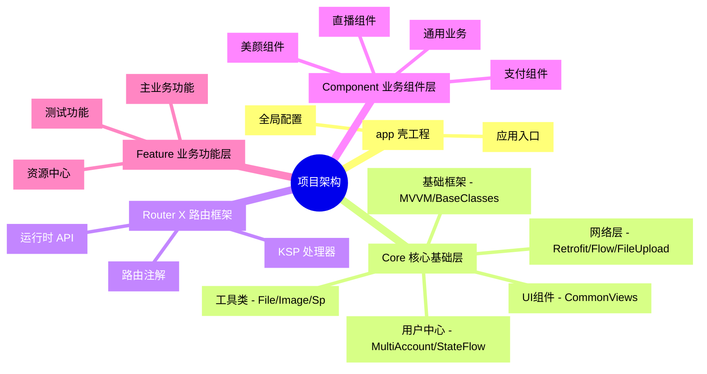

# 🏗️ Android Layered Modular Architecture

本项目是一个基于 **分层模块化架构 (Layered Modular Architecture)** 的 Android 企业级基础框架。致力于提供高解耦、高性能、可扩展的开发体验。

> [!TIP]
> 本项目已集成 **Router X** 路由框架与 **KSP** 代码生成技术，实现业务模块间的物理隔离与逻辑连接。

---

## 🧠 项目架构思维导图 (Mind Map)

---

## 📦 模块职责说明 (Module Responsibilities)

### 1. 🚀 应用外壳 (App Layer)
- **:app**: 组合所有业务模块，负责 Application 的初始化、全局配置及打包配置。

### 🛰️ 核心基础层 (Core Layer)
- **:core:core_base**: 提供 MVVM 基础类、标题页、列表页、弹框、权限、Insets、通用 View 等基础能力。使用说明见 [core_base 使用说明](../core/core_base/docs/core_base_usage.md)。
  - 网络版本发布流程见 [core_base 网络版本发布手册](../core/core_base/docs/core_base_publish.md)。
- **:core:core_network**: 深度封装 Retrofit 3。主要特性：
    - **协程化 API**: 通过 `awaitResult()` 实现线性代码书写。
    - **全局拦截**: `GlobalNetHandler` 统一处理业务 Code（如 Token 失效）。
    - **文件下载**: 集成 `Flow` 实时回调下载进度。
    - **[NEW] 文件上传**: 提供 `toProgressPart` 扩展，支持多文件上传及进度监听。
- **:core:core_user**: 响应式用户管理中心。主要特性：
    - **实时监听**: 使用 `StateFlow` 全局响应用户信息变更。
    - **多账号体系**: 数据库驱动的多账号存储，支持快速切换。
    - **高并发保护**: 使用 `Mutex` 锁与双重校验防止“缓存击穿”。
    - **扩展数据**: 支持用户自定义 JSON 数据的自动解析与内存缓存（使用 `ConcurrentHashMap`）。
- **:core:core_util**: 常用工具类集合。
    - **Coil 3 深度集成**: 提供 `ImageLoaderUtil`。支持：
        - **双重缓存 (loadPinned)**: 内存 + 磁盘强缓存，适用于头像、礼物等高频小资源。
        - **GIF 安全加载**: 自动关闭内存缓存防止 OOM，确保动画流畅。
        - **ImageView 扩展**: 提供 `loadUrl`, `loadRes`, `loadFile` 等简洁调用方式。

### 3. 🛣️ 路由框架 (Router X)
由项目原生维护的高性能路由系统：
- **零反射**: 完全基于 KSP 在编译期生成代码。
- **自动发现**: 使用 SPI 机制，新增模块无需手动注册。
- **强类型注入**: `@Param` 注解支持 Intent 参数自动赋值。

### 4. 🧩 业务组件与功能 (Component & Feature)
- **Component**: 侧重于**可复用的业务能力**（如支付、分享、定位）。
- **Feature**: 侧重于**独立的业务页面**（如首页、个人中心）。

---

## 🛠️ 技术栈 (Tech Stack)

| 领域 | 技术方案 |
| :--- | :--- |
| **开发语言** | Kotlin 2.x |
| **UI 框架** | ViewBinding + Jetpack Compose (兼容) |
| **异步处理** | Kotlin Coroutines & Flow |
| **网络请求** | Retrofit 3 + OkHttp 5 |
| **本地存储** | MMKV (KeyValue) + Room (DB) |
| **代码生成** | KSP (Kotlin Symbol Processing) |
| **架构模式** | MVVM / MVI |

---

## 📜 开发规范与建议

1. **资源命名**: 强制使用 `snake_case`。Layout 必须包含前缀：`activity_`, `fragment_`, `view_`, `item_`, `dialog_`.
2. **依赖管理**: 统一在 `gradle/libs.versions.toml` 中维护。
3. **通信机制**: 跨模块通信必须通过 `Router` 或 `ProvideService` 接口，禁止模块间直接引用。

---

## 🚀 提效工作流 (Workflows)

项目中内置了 AI 驱动的快捷指令：
- `/check-rules`: 自动扫描代码是否符合项目规范。
- `/new-page`: 一键生成 Activity + ViewModel + 路由注册。
- `/run-app`: 自动化打包并部署测试镜像。

---

## 📈 架构优势
- **低耦合**: 模块间物理隔离，依赖倒置。
- **编译快**: KSP 效率远高于 KAPT，模块化支持并行编译。
- **易维护**: 职责边界清晰，新人上手成本低。
