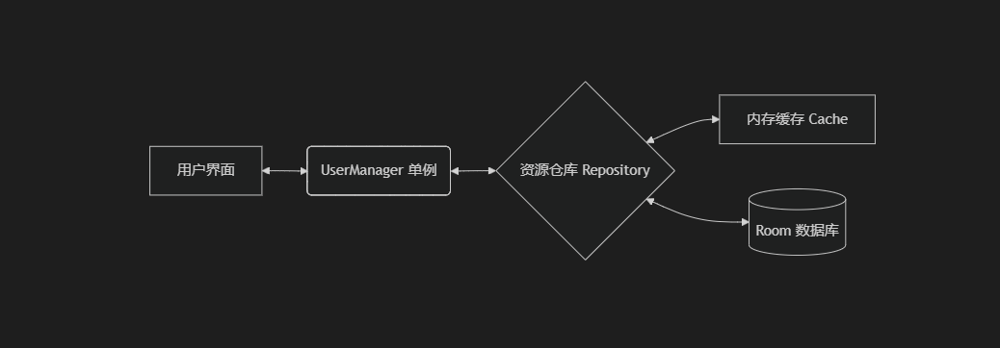

# ApplicationArchitecture

本文档记录了本项目的架构设计及核心组件优化说明。




## 核心优化：User 模块 (core_user)

### 1. 线程安全与并发控制
- **ConcurrentHashMap**: 应用于 `UserManager` 的扩展数据缓存，确保多线程并发访问/修改缓存时的线程安全。
- **Mutex**: 在冷启动获取当前用户时使用协程互斥锁，防止并发请求导致的多次数据库冗余查询（缓存击穿保护）。

### 2. 响应式状态管理 (StateFlow)
- 核心状态（如 `currentUserFlow`）通过 `stateIn` 操作符转化为**热流**，实现了全局单例范围内的跨界面、跨组件状态共享，且内存管理更加稳健。

### 3. 数据层封装
- 应用了 `UserRepository` 模式，实现了底层 DAO 与上层 Manager 的解耦，维护了单一数据流向。

---

## 数据库架构导出配置 (Room Schema)

在各数据模块的 `build.gradle` 中，你会看到类似的 KSP 配置：

```gradle
ksp {
    arg("room.schemaLocation", "$projectDir/schemas")
}
```

### 作用说明：
1. **自动架构记录**：当 `@Database` 的 `exportSchema` 设为 `true` 时，Room 编译器会自动将当前版本的表结构、索引等信息导出为 JSON 文件。
2. **版本追踪**：导出的 JSON 文件存储在模块下的 `schemas/` 目录中。通过 Git 追踪这些文件，开发者可以清晰地查看数据库结构的演进历史。
3. **自动化测试支持**：Room 的 `MigrationTestHelper` 库依赖这些导出的 JSON 文件来模拟旧版本环境，从而安全地执行并验证数据库迁移（Migration）逻辑。
4. **编译时保障**：有助于在编译阶段提早发现由于架构不一致导致的潜在运行时崩溃。

---

## 模块可见性约束 (Encapsulation)
本项目严格遵守模块化封装原则，使用 `internal` 关键字隐藏了非必要的实现类：
- **Public API**: `UserManager`, `UserEntity` (仅公开业务入口和必要的数据模型)。
- **Internal Impl**: `UserRepository`, `UserCache`, `UserDatabase`, `UserDao` (隐藏底层实现细节)。
